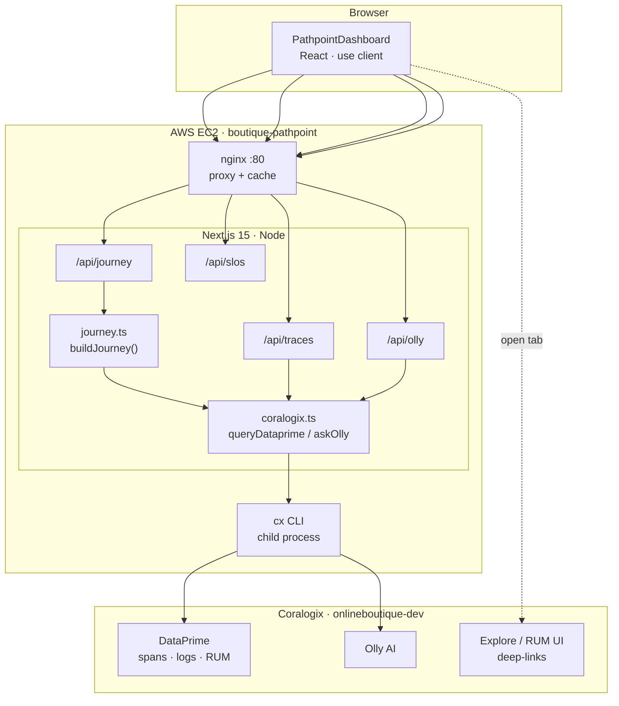
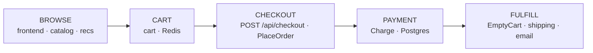
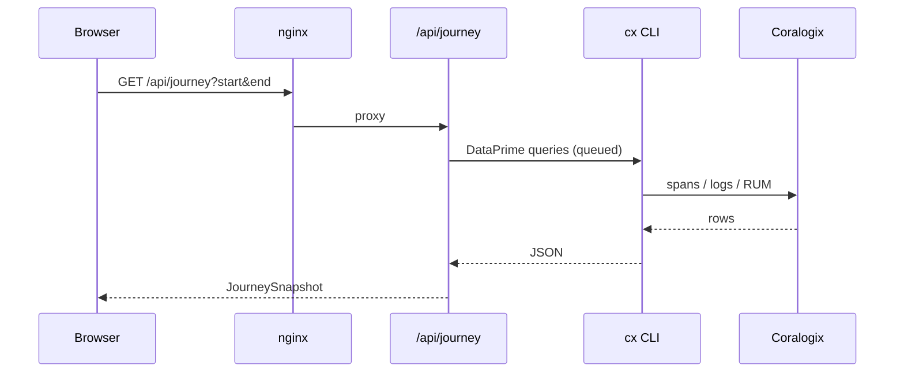
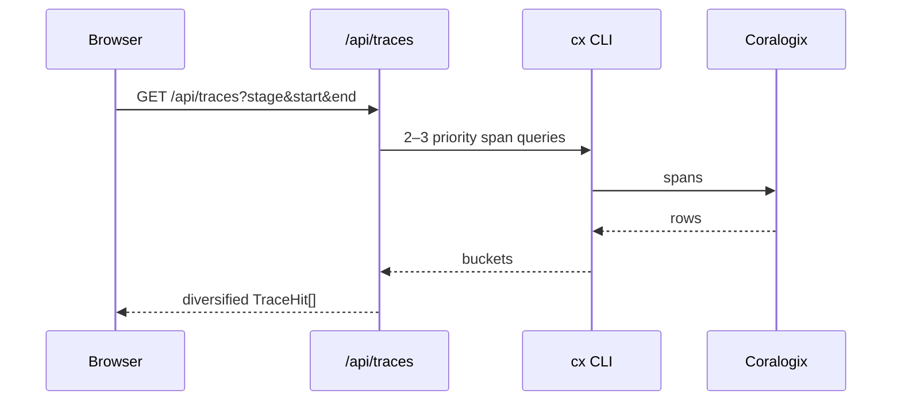
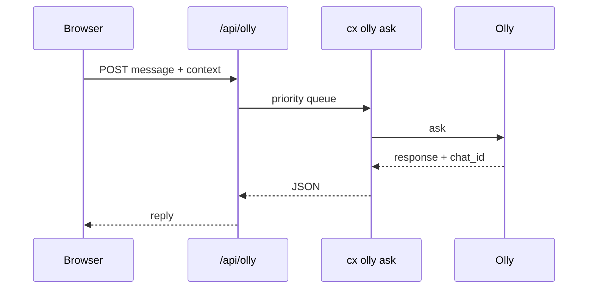

# Architecture · Pathpoint · Online Boutique

> Technical architecture for the **Online Boutique Pathpoint** — a purchase-journey traffic-light dashboard for Coralogix application `astronomy-demo`. This document explains how lights are calculated, where each UI box gets its data, and how requests flow from the browser to Coralogix DataPrime.
>
> Source: [tpasin/pathpoint-boutique](https://github.com/tpasin/pathpoint-boutique). Right-click any box in the UI → **View source on GitHub** to jump to the defining file.

## Contents

- [A. System architecture](#a-system-architecture)
- [B. Traffic lights](#b-traffic-lights)
- [C. Purchase journey map](#c-purchase-journey-map)
- [D. Request flows](#d-request-flows)
- [E. File map](#e-file-map)

---

## A. System architecture

### A.1 Deployment

| Aspect | Value |
|---|---|
| Framework | Next.js **15.5** (App Router), React 19, TypeScript |
| API runtime | Node.js (`runtime = "nodejs"`) |
| Host | AWS **EC2** (Amazon Linux 2023), **t3.medium** |
| Process | `systemd` unit `boutique-pathpoint` |
| Edge | **nginx** on port **80** (proxy + API cache + rate limits) |
| App port | **3000** (loopback only; public via nginx) |
| Data CLI | Coralogix `cx` at `/usr/local/bin/cx` |
| Coralogix UI | `https://onlineboutique-dev.app.cx498.coralogix.com` |
| Application | `astronomy-demo` (Online Boutique microservices) |

Deploy with `npm run deploy:aws` / `npm run redeploy:aws`. Secrets live in `/etc/boutique-pathpoint.env` on the instance (never committed).

### A.2 Layer diagram

**`CX_API_KEY` never reaches the browser.** All Coralogix queries run on the server. The client only receives aggregated JSON and Explore URLs.

### A.3 Caching

| Layer | Where | Policy |
|---|---|---|
| Journey snapshot | `/api/journey` | Short TTL + stale-while-revalidate |
| Query cache | `coralogix.ts` | Per DataPrime query key |
| `cx` concurrency queue | `coralogix.ts` | Max concurrent CLI processes; traces/Olly prioritized |
| nginx | `/api/journey`, `/api/slos` | Edge cache for GET |

---

## B. Traffic lights

| Light | Meaning |
|---|---|
| **Green** | Healthy within the selected window |
| **Yellow** | Degraded (elevated errors or latency) |
| **Red** | Critical failure rate or hard errors |
| **Grey** | No signal / not applicable in range |

Stage light = worst of its contributing signals (e.g. Browse = frontend product APIs ∪ product-catalog health).

---

## C. Purchase journey map

| Stage | Primary services / ops |
|---|---|
| Browse | `frontend` product APIs, `product-catalog`, `recommendation` |
| Cart | `cart`, Redis, `AddItemAsync` logs |
| Checkout | `POST /api/checkout`, `checkout` PlaceOrder / prepare |
| Payment | `payment` Charge, INSERT transactions |
| Fulfill | EmptyCart, `shipping`, `email` |

Business KPIs, top products, RUM users, and Session Replay are derived in `buildJourney()` (`src/lib/journey.ts`) from the same time window.

---

## D. Request flows

### D.1 Journey load

### D.2 Stage traces

### D.3 Ask Olly

---

## E. File map

| Path | Role |
|---|---|
| `src/components/PathpointDashboard.tsx` | UI: stages, steps, KPIs, traces, RUM, Olly |
| `src/lib/journey.ts` | `buildJourney()` — lights, metrics, products, replays |
| `src/lib/coralogix.ts` | `queryDataprime`, `askOlly`, caches, queue |
| `src/lib/github-source.ts` | Right-click → GitHub deep links |
| `src/app/api/journey/route.ts` | Journey API |
| `src/app/api/traces/route.ts` | Per-stage traces |
| `src/app/api/olly/route.ts` | Olly proxy |
| `src/app/api/slos/route.ts` | Boutique SLOs |
| `src/app/architecture/` | This documentation page |
| `deploy/aws/` | EC2 launch / redeploy / nginx bootstrap |
| `ARCHITECTURE.md` | Source for `/architecture` |

Markers `@pathpoint-source …` in source files power **View / Edit on GitHub** from the context menu.
