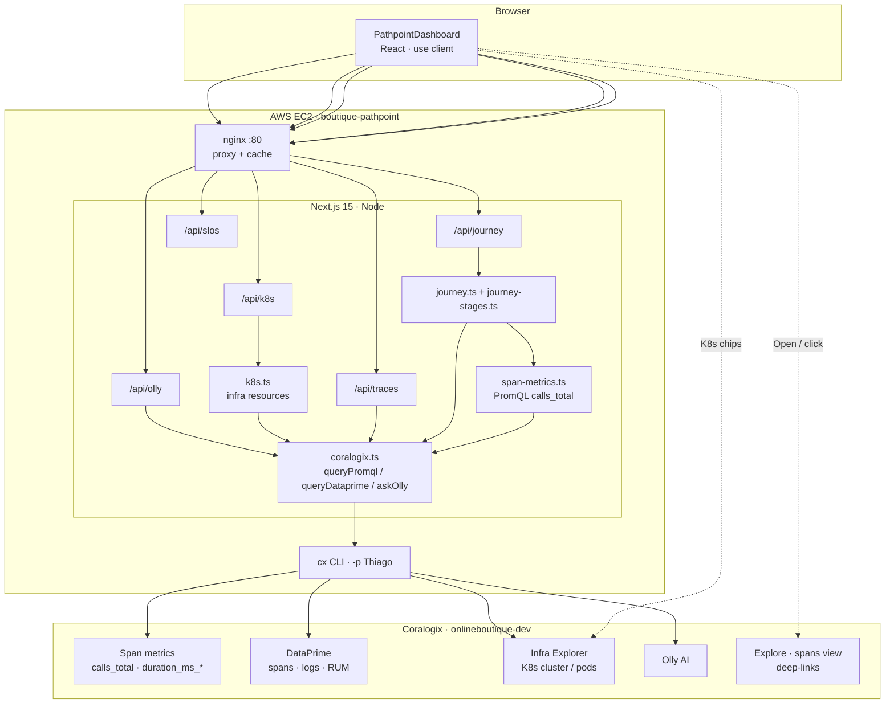
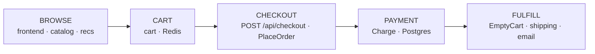
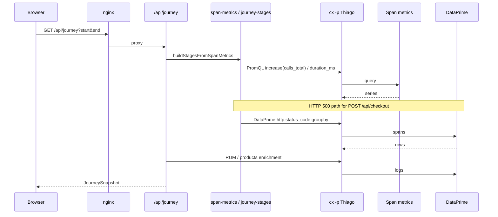
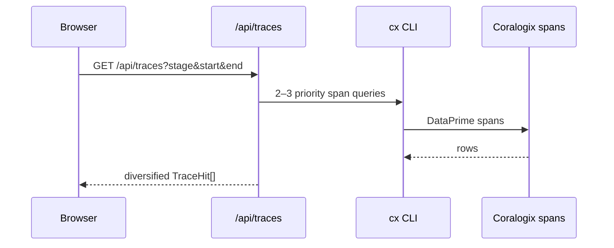
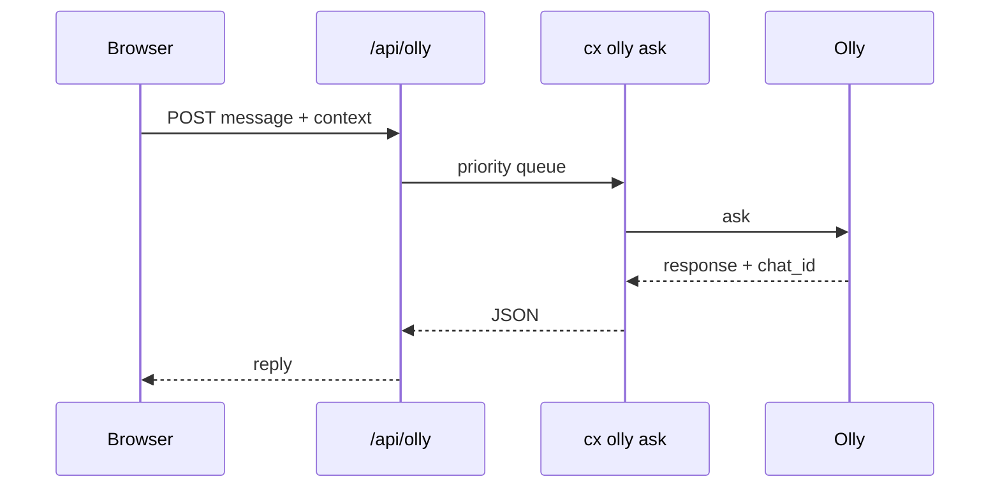

# Architecture · Pathpoint · Online Boutique

> Technical architecture for the **Online Boutique Pathpoint** — a purchase-journey traffic-light dashboard for Coralogix application `astronomy-demo`. Lights come from **span metrics** (`calls_total` / `duration_ms_*`); clicks open **matching raw spans** in Explore. Kubernetes context and RUM/Session Replay sit alongside.
>
> Source: [tpasin/pathpoint-boutique](https://github.com/tpasin/pathpoint-boutique). Right-click any box → **View Infrastructure** / **View source on GitHub**.

## Contents

- [A. System architecture](#a-system-architecture)
- [B. Traffic lights & span metrics](#b-traffic-lights--span-metrics)
- [C. Purchase journey map](#c-purchase-journey-map)
- [D. Request flows](#d-request-flows)
- [E. Kubernetes panel](#e-kubernetes-panel)
- [F. File map](#f-file-map)

---

## A. System architecture

### A.1 Deployment

| Aspect | Value |
|---|---|
| Framework | Next.js **15.5** (App Router), React 19, TypeScript |
| API runtime | Node.js (`runtime = "nodejs"`) |
| Host | AWS **EC2** (Amazon Linux 2023), **t3.medium** |
| Process | `systemd` unit `boutique-pathpoint` |
| Edge | **nginx** on port **80** (proxy + API cache + rate limits) |
| App port | **3000** (loopback only; public via nginx) |
| Data CLI | Coralogix `cx` · profile **`Thiago`** (`CX_PROFILE=Thiago`) |
| Coralogix UI | `https://onlineboutique-dev.app.cx498.coralogix.com` |
| Application | `astronomy-demo` (Online Boutique microservices) |
| Live | [http://18.226.161.158/](http://18.226.161.158/) |

Deploy with `npm run deploy:aws` / `npm run redeploy:aws`. Secrets live in `/etc/boutique-pathpoint.env` on the instance (never committed). Prefer **`CX_PROFILE=Thiago`** over a bare API key when both are set.

### A.2 Layer diagram

**Credentials never reach the browser.** PromQL, DataPrime, and infra calls run on the server. The client receives aggregated JSON plus Explore / Infra Explorer URLs.

### A.3 Caching

| Layer | Where | Policy |
|---|---|---|
| Journey snapshot | `/api/journey` | Short TTL + stale-while-revalidate |
| Query cache | `coralogix.ts` | Per DataPrime / PromQL key |
| K8s snapshot | `k8s.ts` | ~90s TTL |
| `cx` concurrency queue | `coralogix.ts` | Max concurrent CLI; traces/Olly prioritized |
| nginx | `/api/journey`, `/api/slos` | Edge cache for GET |

---

## B. Traffic lights & span metrics

| Light | Meaning |
|---|---|
| **Green** | Healthy within the selected window |
| **Yellow** | Degraded (elevated errors or latency) |
| **Red** | Critical failure rate (≥15% errors by default) or hard errors |
| **Grey** | No signal / not applicable in range |

### B.1 Signal source (Pomelo-style)

| Concern | Source | Notes |
|---|---|---|
| Stage / step **volume & latency** | PromQL **`calls_total`**, **`duration_ms_sum` / `_count`** | Filtered by `service_name` (+ optional `span_name`) |
| gRPC / otel **errors** | `calls_total{status_code="STATUS_CODE_ERROR"}` | e.g. payment `Charge`, checkout `PlaceOrder` |
| Frontend **HTTP 500s** | Raw spans `http.status_code` | Boutique HTTP spans often stay `STATUS_CODE_UNSET` in metrics — so `/api/checkout` errors are counted from DataPrime |
| Drill-down | Explore **`spansView=spans`** | Same services/ops as the metric light |

Stage light = **worst** of its steps (e.g. Checkout = worst of POST `/api/checkout` HTTP 500s and PlaceOrder span-metric errors).

### B.2 Checkout errors vs Payment / Charge errors

| Card | Layer | What it measures |
|---|---|---|
| **Checkout errors** | Frontend API | `POST /api/checkout` with **HTTP 500** — customer-facing failure |
| **Payment / Charge errors** | Payment service | `Charge` spans with error / otel ERROR / non-zero gRPC — usually the upstream cause |

Typical chain: Charge fails → PlaceOrder fails → `POST /api/checkout` returns 500.

Hover **howto** on a box shows the PromQL (and, for HTTP steps, the DataPrime status query).

---

## C. Purchase journey map

| Stage | Span-metric services | Error nuance |
|---|---|---|
| Browse | `frontend`, `product-catalog`, `recommendation` | Product page can use HTTP status from spans |
| Cart | `cart` | AddItem / GetCart / Redis ops |
| Checkout | `frontend` + `checkout` | HTTP 500 on checkout API + PlaceOrder `STATUS_CODE_ERROR` |
| Payment | `payment` | Charge / INSERT |
| Fulfill | `shipping`, `email`, `cart` | EmptyCart latency / errors |

**Enrichment** (same time window, not used for primary lights): cart `AddItemAsync` product logs, RUM users, Session Replay, boutique SLOs.

**UI behavior**

- Left-click stage/step/KPI → Explore (matching **spans**)
- Stage **Traces** → `/api/traces` raw span samples
- Right-click → **View Infrastructure** (K8s panel) · Ask Olly · GitHub source

---

## D. Request flows

### D.1 Journey load (span metrics + enrichment)

### D.2 Stage traces (raw spans evidence)

### D.3 Ask Olly

---

## E. Kubernetes panel

Above Olly: **Kubernetes · Infra Explorer**. Right-click a stage/step → **View Infrastructure** (or click a box) to load:

| Field | Source |
|---|---|
| Cluster / Namespace | Fixed boutique: `onlineboutique` / `astronomy-demo` |
| Deployment / Pod / Node | `cx infra resources` + pod raw-data `nodeName` |
| CPU · CPU request · Memory · Memory request · Memory trend · Containers | K8s PromQL (`k8s_pod_*`, `k8s_container_*`) |

Chip links open Coralogix **Infrastructure Explorer** (Kubernetes catalog search).

API: `GET /api/k8s?stage=&step=`.

---

## F. File map

| Path | Role |
|---|---|
| `src/components/PathpointDashboard.tsx` | UI: stages, steps, KPIs, K8s, traces, RUM, Olly |
| `src/lib/journey.ts` | `buildJourney()` — span-metric stages + RUM/products |
| `src/lib/journey-stages.ts` | Assemble Browse→Fulfill from span metrics |
| `src/lib/span-metrics.ts` | PromQL helpers, HTTP 500 counting, Explore error links |
| `src/lib/k8s.ts` | Cluster/pod/node + usage metrics, Infra Explorer URLs |
| `src/lib/coralogix.ts` | `queryPromql`, `queryDataprime`, `askOlly`, queue (`CX_PROFILE` first) |
| `src/lib/coralogix-links.ts` | Client Explore / Infra / Session Replay URLs (`spansView=spans`) |
| `src/lib/github-source.ts` | Right-click → GitHub deep links |
| `src/app/api/journey/route.ts` | Journey API |
| `src/app/api/traces/route.ts` | Per-stage raw spans |
| `src/app/api/k8s/route.ts` | Kubernetes context |
| `src/app/api/olly/route.ts` | Olly proxy |
| `src/app/api/slos/route.ts` | Boutique SLOs |
| `src/app/architecture/` | This documentation page |
| `deploy/aws/` | EC2 launch / redeploy / nginx bootstrap |
| `ARCHITECTURE.md` | Source for `/architecture` |

Markers `@pathpoint-source …` in source files power **View / Edit on GitHub** from the context menu.
